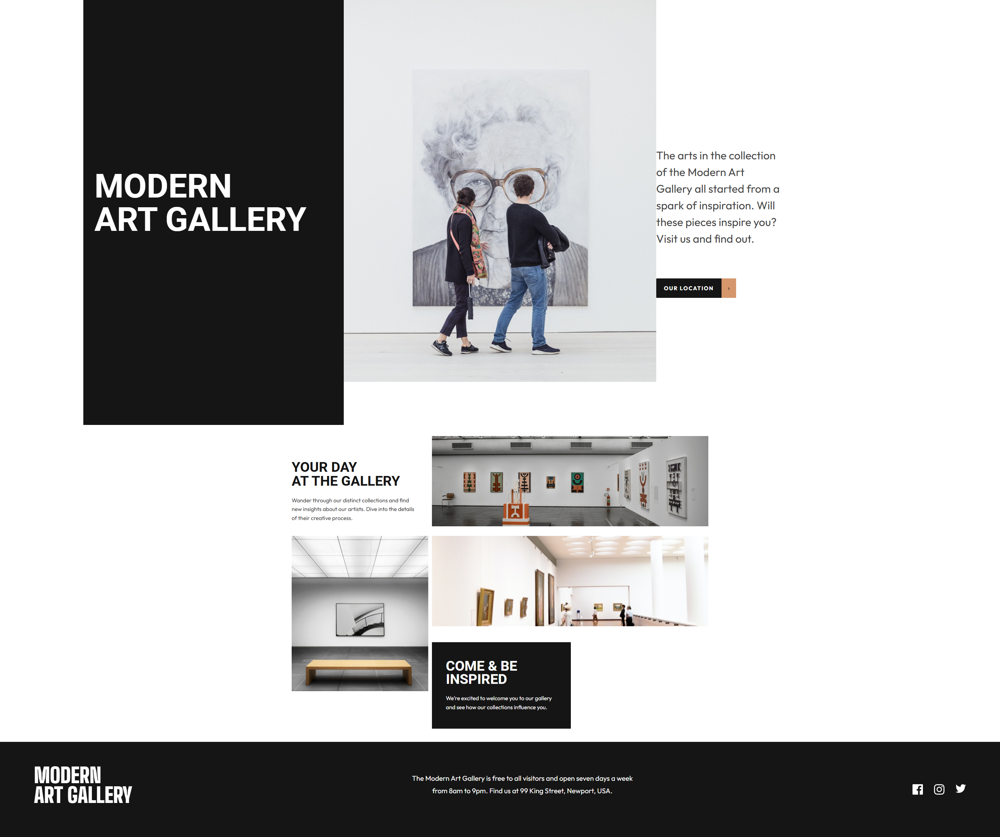

# 🎨 Modern Art Gallery - Responsive Web

Este proyecto es una landing page para una **Galería de Arte Moderno**, diseñada con un enfoque en la estética visual y la adaptabilidad total a diferentes dispositivos. El objetivo principal fue practicar layouts complejos y asegurar una experiencia de usuario fluida mediante **Responsive Design**.

---

## 🚀 Demo en Vivo
Puedes ver el resultado final aquí:
👉 [**Ver Proyecto en GitHub Pages**](https://laurasace93.github.io/Proyecto-Web-Modern-Art-Gallery-con-Responsive/)

---

## ✨ Características
* **Diseño Responsive:** Adaptación perfecta desde smartphones de 320px hasta pantallas 4K.
* **Layout Moderno:** Uso estratégico de CSS Grid y Flexbox para organizar las obras de arte.
* **Interactividad:** Efectos visuales al pasar el cursor (hover) y transiciones suaves.
* **Código Semántico:** Estructura HTML5 limpia para mejorar el SEO y la accesibilidad.

---

## 🛠️ Tecnologías Utilizadas
* **HTML5:** Estructura de la web.
* **CSS3:** Estilos personalizados, variables de color y Media Queries.
* **Google Fonts:** Integración de tipografías específicas para el sector artístico.

---

## 📸 Screenshots



---

## 📂 Estructura del Repositorio
```text
├── img/                # Imágenes de las obras de arte y logos
├── css/                # Hojas de estilo (estilos principales y responsive)
├── index.html          # Estructura principal del sitio
└── README.md           # Documentación del proyecto
